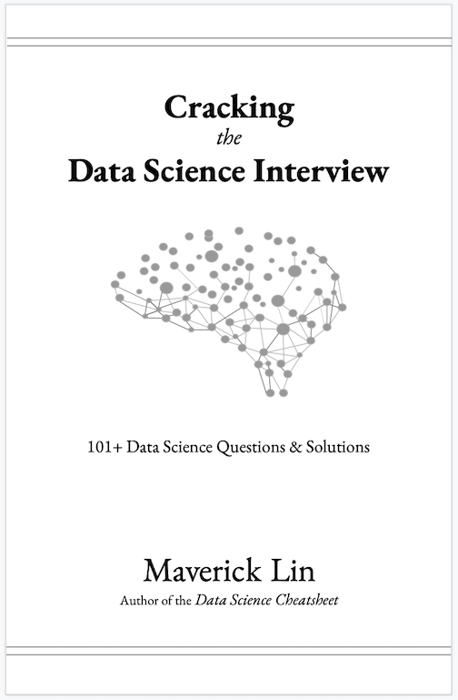

# Cracking the Data Science Interview

Welcome to the *Cracking the Data Science Interview* Github page. Here you will find data science related links, tutorials, blog posts, code snippets, interview preparation, case studies, and more! Have fun!

# Data Science Interview Preparation Map

# General
- [How Do I Prepare For a Data Science Interview (Quora)](https://www.quora.com/How-do-I-prepare-for-a-data-scientist-interview)

- [How to Ace a Data Science Interview (Blog)](https://alyaabbott.wordpress.com/2014/10/01/how-to-ace-a-data-science-interview/)

- [How To Learn Data Science If You’re Broke (Towards Data Science)](https://towardsdatascience.com/how-to-learn-data-science-if-youre-broke-7ecc408b53c7)

- [Data Science Interview Questions (PDF)](https://rstudio-pubs-static.s3.amazonaws.com/172473_91262a8a4188445a8b5e81d5d31c7731.html)

- [120 Data Science Interview Questions](https://github.com/kojino/120-Data-Science-Interview-Questions)

- [Kaggle Kernels](https://www.kaggle.com/kernels)

- [Data Science Cheatsheets (Github Repo)](https://github.com/abhat222/Data-Science--Cheat-Sheet)

# Online Resources for Practice

- [Leetcode (Over 1350 Qustions To Practice Coding)](https://leetcode.com)

- [HackerRank (Coding)](https://www.hackerrank.com/home?utm_expid=.2u09ecQTSny1HV02SEVoCg.1&utm_referrer=https%3A%2F%2Fwww.google.com%2F)

- [SQLZoo (Place to Practice SQL)](https://sqlzoo.net)

- [SQLCourse- Interactive Online SQL Training](http://www.sqlcourse.com)

# Data Science Interview Prep Material

## Mathematical Prequisites
### Statistics
- [Statistics for Data Science (Blog)](https://blog.floydhub.com/statistics-for-data-science/)

- [The Math Behind A/B Testing with Example Python Code (Towards Data Science)](https://towardsdatascience.com/the-math-behind-a-b-testing-with-example-code-part-1-of-2-7be752e1d06f)

### Probability
- [Probability Cheatsheet (PDF)](http://www.wzchen.com/s/probability_cheatsheet.pdf), [(Github Repo)](https://github.com/wzchen/probability_cheatsheet)

- [Basics of Probability for Data Science explained with examples in R (Analytics Vidhya)](https://www.analyticsvidhya.com/blog/2017/02/basic-probability-data-science-with-examples/?source=post_page-----2db4f651bd63----------------------)

### Linear Algebra
- [Linear Algebra Cheat Sheet for Deep Learning (Towards Data Science)](https://towardsdatascience.com/linear-algebra-cheat-sheet-for-deep-learning-cd67aba4526c)

- [No Bullshit Guide to Linear ALgebra- Linear algebra explained in four pages (PDF)](https://www.souravsengupta.com/cds2016/lectures/Savov_Notes.pdf)

## Computer Science

### Data Structures
- [A Data Scientist’s Guide to Data Structures & Algorithms, Part 1 (Towards Data Science)](https://towardsdatascience.com/a-data-scientists-guide-to-data-structures-algorithms-1176395015a0)

- [A Data Scientist’s Guide to Data Structures & Algorithms, Part 2 (Towards Data Science)](https://towardsdatascience.com/a-data-scientists-guide-to-data-structures-algorithms-part-2-6bc27066f3fe)

- [Python Data Science Handbook](https://github.com/jakevdp/PythonDataScienceHandbook)

### Algorithms
- [Top Algorithms/Data Structures/Concepts every computer science student should know](https://medium.com/@codingfreak/top-algorithms-data-structures-concepts-every-computer-science-student-should-know-e0549c67b4ac)

### Databases
- [CAP Theorem (Wikipedia)](https://en.wikipedia.org/wiki/CAP_theorem)
- [Choosing The Right Database (Towards Data Science)](https://towardsdatascience.com/choosing-the-right-database-c45cd3a28f77)
### SQL
- [How To Ace Data Science Interviews: SQL (Towards Data Science)](https://towardsdatascience.com/how-to-ace-data-science-interviews-sql-b71de212e433)

## Machine Learning

- [A Tour of Machine Learning Algorithms (Blog)](https://machinelearningmastery.com/a-tour-of-machine-learning-algorithms/)

- [41 Essential Machine Learning Interview Questions (Blog)](https://www.springboard.com/blog/machine-learning-interview-questions/?source=post_page-----2db4f651bd63----------------------)
### Supservised Learning Algorithms

- [Linear Regression — Detailed View](https://towardsdatascience.com/linear-regression-detailed-view-ea73175f6e86)

- [7 Regression Techniques you should know!](https://www.analyticsvidhya.com/blog/2015/08/comprehensive-guide-regression/)

- [Naive Bayes Classification — Theory](https://medium.com/machine-learning-101/chapter-1-supervised-learning-and-naive-bayes-classification-part-1-theory-8b9e361897d5)

- [SVM (Support Vector Machine) — Theory](https://medium.com/machine-learning-101/chapter-2-svm-support-vector-machine-theory-f0812effc72)

- [Decision Trees - Explained, Demystified and Simplified](https://adityashrm21.github.io/Decision-Trees/)

- [An Implementation and Explanation of the Random Forest in Python](https://towardsdatascience.com/an-implementation-and-explanation-of-the-random-forest-in-python-77bf308a9b76)

- [A Kaggle Master Explains Gradient Boosting](http://blog.kaggle.com/2017/01/23/a-kaggle-master-explains-gradient-boosting/)

### Unupservised Learning Algorithms

- [Unsupervised Learning and Data Clustering](https://towardsdatascience.com/unsupervised-learning-and-data-clustering-eeecb78b422a)

- [Understanding K-means Clustering in Machine Learning](https://towardsdatascience.com/understanding-k-means-clustering-in-machine-learning-6a6e67336aa1)

- [Hierarchical Clustering](https://www.saedsayad.com/clustering_hierarchical.htm)

- [Introduction to autoencoders.](https://www.jeremyjordan.me/autoencoders/)

- [An Intuitive Introduction to Generative Adversarial Networks](http://blog.kaggle.com/2018/01/18/an-intuitive-introduction-to-generative-adversarial-networks/)

### Reinforcement Learning Algorithms

- [Applications of Reinforcement Learning in Real World (Towards Data Science)](https://towardsdatascience.com/applications-of-reinforcement-learning-in-real-world-1a94955bcd12)

- [Open AI Gym](https://gym.openai.com)

- [Simple Reinforcement Learning Methods to Learn CartPole (Blog)](http://kvfrans.com/simple-algoritms-for-solving-cartpole/)

- [An introduction to Policy Gradients with Cartpole and Doom (freeCodeCamp)](https://www.freecodecamp.org/news/an-introduction-to-policy-gradients-with-cartpole-and-doom-495b5ef2207f/)

- [Implementation of Reinforcement Learning Algorithms (Github Repo)](https://github.com/dennybritz/reinforcement-learning)

# Miscellaneous

- [A Gentle Introduction To Graph Theory](https://medium.com/basecs/a-gentle-introduction-to-graph-theory-77969829ead8)

- [How to get started with machine learning on graphs](https://medium.com/octavian-ai/how-to-get-started-with-machine-learning-on-graphs-7f0795c83763)

- [Solving the Knapsack Problem with Dynamic Programming](https://dev.to/downey/solving-the-knapsack-problem-with-dynamic-programming-4hce)

- [An Overview of Monte Carlo Methods](https://towardsdatascience.com/an-overview-of-monte-carlo-methods-675384eb1694)

- [Introductory Guide on Linear Programming](https://www.analyticsvidhya.com/blog/2017/02/lintroductory-guide-on-linear-programming-explained-in-simple-english/)

- [ARIMA Models](http://www.forecastingsolutions.com/arima.html)

# Product 
- [Key Performance Indicators](https://www.shopify.com/blog/7365564-32-key-performance-indicators-kpis-for-ecommerce)

# Data Science Case Studies
- [Uber Data Science](https://www.uber.com/us/en/careers/teams/data-science/)

- [BCG Gamma](https://www.bcg.com/beyond-consulting/bcg-gamma/default.aspx)

- [McKinsey Solutions](https://www.mckinsey.com/solutions)

- [Bain Advanced Analytics](https://www.bain.com/vector-digital/advanced-analytics/)

- [Facebook Data Science](https://research.fb.com/teams/core-data-science/)

- [Kaggle](https://www.kaggle.com)

# Books
- [Cracking the Coding Interview](https://www.amazon.com/Cracking-Coding-Interview-Programming-Questions/dp/0984782850/ref=sr_1_1?keywords=cracking+the+co&qid=1575944295&sr=8-1)

- [The Hundred-Page Machine Learning Book ](https://www.amazon.com/Hundred-Page-Machine-Learning-Book/dp/199957950X/ref=pd_lutyp_crtyp_simh_1_7?_encoding=UTF8&pd_rd_i=199957950X&pd_rd_r=fbee59df-96ce-45b6-a41d-dcb9a769ad94&pd_rd_w=Dpj0r&pd_rd_wg=EokMX&pf_rd_p=11bf186d-590b-449a-8161-5414a5d28305&pf_rd_r=X99FPRSYC7DW3CXYJHCK&psc=1&refRID=X99FPRSYC7DW3CXYJHCK)

- [Deep Learning](http://www.deeplearningbook.org)

# Blogs

- [Machine Learning Mastery](https://machinelearningmastery.com)

- [GeeksforGeeks](https://www.geeksforgeeks.org)

- [No Free Hunch- The Official Blog of Kaggle.com](http://blog.kaggle.com)

